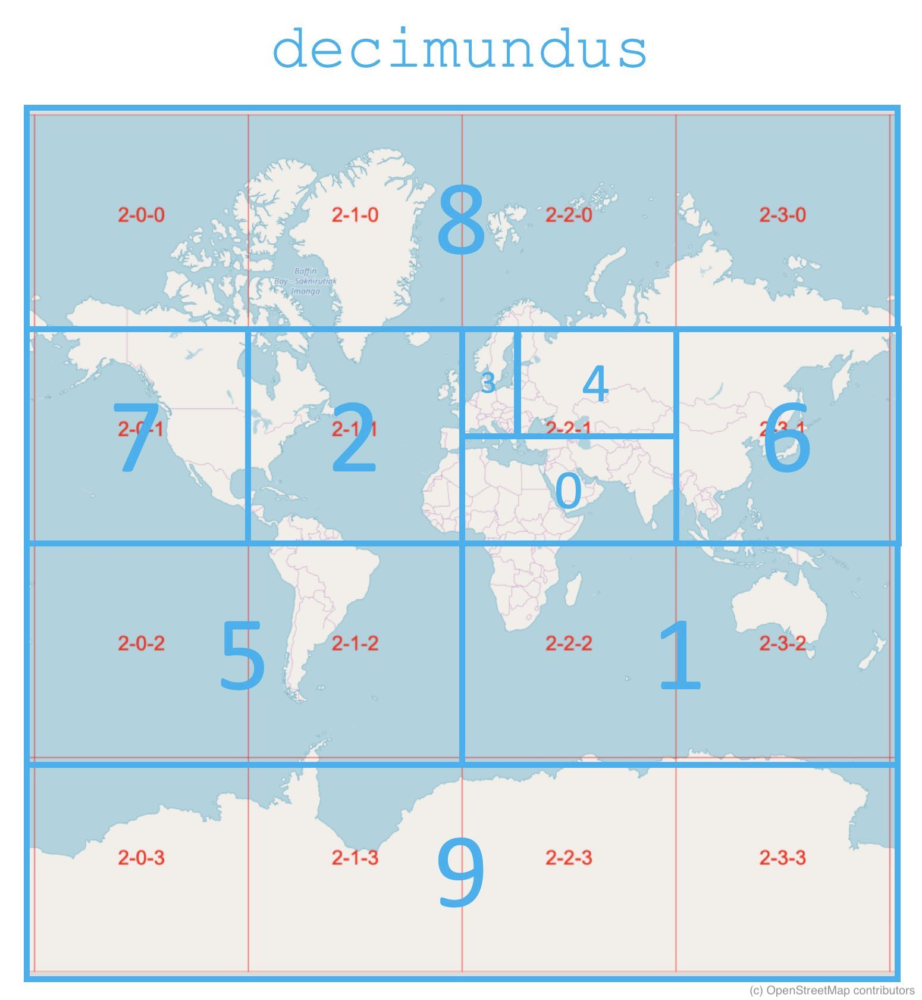

# decimundus
A way to divide the globe into 10 parts for equal amount of OSM data



## #1
- 3/4/3 + 3/5/3

```
minx: 32
miny: 24
maxx: 47
maxy: 31
```

## #2
- 2/2/2 + 2/3/2

```
minx: 32
miny: 32
maxx: 63
maxy: 47
```

## #3
- 2/1/1

```
minx: 16
miny: 16
maxx: 31
maxy: 31
```

## #4
- 4/8/4 + 4/8/5

```
minx: 32
miny: 16
maxx: 35
maxy: 23
```

## #5
- 3/5/2 + 4/9/4 + 4/9/5

```
minx: 36
miny: 16
maxx: 47
maxy: 23
```

## #6
- 2/0/2 + 2/1/2

```
minx: 0
miny: 32
maxx: 31
maxy: 47
```

## #7
- 2/3/1

```
minx: 48
miny: 16
maxx: 63
maxy: 31
```

## #8
- 2/0/1

```
minx: 0
miny: 16
maxx: 15
maxy: 31
```

## #9
- 2/0/0 + 2/1/0 + 2/2/0 + 2/3/0

```
minx: 0
miny: 0
maxx: 63
maxy: 15
```

## #10
- 2/0/3 + 2/1/3 + 2/2/3 + 2/3/3

```
minx: 0
miny: 48
maxx: 63
maxy: 63
```
